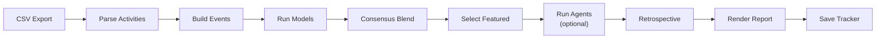

# Feedcast

Predicts Silas's next 24 hours of bottle feeds from Nara Baby CSV exports.

Feed timing is the primary target. Volume estimates are included because
they're operationally useful, but accuracy is measured on timing.

## Quick Start

```bash
python3 -m venv .venv
.venv/bin/pip install -r requirements.txt
```

1. Drop the latest Nara export into `exports/`.
2. Run `.venv/bin/python scripts/run_forecast.py`.
3. Read the report at `report/report.md`.

```bash
# Full pipeline (scripted models + LLM agents):
.venv/bin/python scripts/run_forecast.py

# Specific export:
.venv/bin/python scripts/run_forecast.py --export-path exports/export_narababy_silas_YYYYMMDD.csv

# Scripted models only (skip LLM agents):
.venv/bin/python scripts/run_forecast.py --skip-agents
```

LLM agent forecasts require local `claude` and `codex` CLIs with working auth.
Use `--skip-agents` if they're unavailable.

Each run updates these generated artifacts:

- `report/report.md` — the human-readable forecast report
- `report/schedule.png` — the featured schedule chart
- `report/spaghetti.png` — the all-model trajectory chart
- `report/diagnostics.yaml` — structured model diagnostics for the run
- `tracker.json` — stored predictions and retrospective history

## Pipeline



| Step | What happens | Why |
| ---- | ------------ | --- |
| Parse Activities | Filter bottle feeds and breastfeeds from the CSV, discard pre-floor data | Raw exports contain all activity types; we only need feeding events |
| Build Events | Create bottle-centered events, optionally merging nearby breastfeed volume | Models need a uniform event type anchored on bottle-feed timestamps |
| Run Models | Execute three scripted models independently | Each uses a different forecasting methodology for diversity |
| Consensus Blend | Median-timestamp ensemble across the scripted models | Reduces individual model noise without requiring a meta-learner |
| Select Featured | Default to the consensus blend; fall back through a static scripted tiebreaker | One forecast is highlighted in the report as the recommended answer |
| Run Agents | Claude and Codex each produce independent forecasts in persistent workspaces | LLM forecasts complement scripted models with different reasoning |
| Retrospective | Compare the prior run's predictions to newly observed actuals | The only accuracy signal: did we actually predict correctly? |
| Render Report | Generate `report.md`, schedule chart, trajectory chart, and diagnostics | The report is the deliverable; everything else supports it |
| Save Tracker | Append the run entry (predictions + retrospective) to `tracker.json` | Accumulates history for retrospective accuracy tracking |

## Repo Layout

```text
scripts/
  run_forecast.py              CLI entrypoint
feedcast/
  pipeline.py                  End-to-end orchestration
  data.py                      CSV parsing, domain types, fingerprinting
  models/                      Scripted forecasters and consensus blend
    shared.py                  Shared utilities and tuning constants
    recent_cadence.py          Interval baseline
    phase_nowcast.py           Recursive state-space + nowcast
    gap_conditional.py         Event-level autoregressive regression
  agents.py                    Agent runner (points to repo-level agents/)
  tracker.py                   Run persistence and retrospectives
  report.py                    Markdown rendering and atomic report swap
  plots.py                     Schedule and trajectory chart generation
  templates/
    report.md.j2               Jinja2 report template
agents/
  run.sh                       Shell dispatcher for Claude/Codex CLIs
  prompt/prompt.md             Shared agent prompt
  claude/                      Claude persistent workspace
  codex/                       Codex persistent workspace
exports/                       Raw Nara CSV drops (untracked)
report/                        Latest report (tracked, committed)
tracker.json                   Run history with predictions and retrospectives
```

## Intentional Simplicity

Some repo choices are unconventional on purpose. `report/` and `tracker.json`
are operational state, and they still live in the repo because one visible
workspace is simpler than splitting state, outputs, and code across separate
systems.

This project was built by a tired dad trying to add a little order to a
routine-heavy household. The bias is toward local, inspectable workflows that
humans and agents can understand quickly, even when a more "proper" architecture
would be more elaborate.

## Forecast Sources

**Scripted models** run deterministically from the event history:

| Model | Approach |
| ----- | -------- |
| Recent Cadence | Recency-weighted interval between full feeds, rolled forward at constant gap |
| Phase Nowcast Hybrid | Phase-locked oscillator backbone with local regression nowcast for the first gap |
| Gap-Conditional | Weighted linear regression on event state, rolled forward autoregressively |
| Consensus Blend | Median-timestamp ensemble across the three scripted models |

**LLM agents** get the export CSV, a shared prompt, and a persistent workspace:

| Agent | Model |
| ----- | ----- |
| Claude Forecast | claude-opus-4-6 (effort: max) |
| Codex Forecast | gpt-5.4 (reasoning: xhigh) |

Each agent must write `forecast.json` and `methodology.md` to its workspace.
The runner deletes stale outputs before each invocation so a failed run cannot
reuse prior results. Agents are excluded from the consensus blend and are
never auto-featured.

## Evaluation

There is no historical backtesting. The only accuracy signal is **retrospective
performance**: each run compares the prior run's predictions to the actual feeds
observed in the new export. Over time, these retrospective results accumulate in
`tracker.json` and are aggregated into a historical accuracy table in the report.

The featured forecast defaults to the consensus blend. If it's unavailable, the
pipeline falls back through a static scripted tiebreaker list.

## Working with Models

**Add a model:** Create a new file in `feedcast/models/`, implement a forecast
function with the signature `(history, cutoff, horizon_hours) -> Forecast`,
define `MODEL_NAME`, `MODEL_SLUG`, and `MODEL_METHODOLOGY`, then add a
`ModelSpec` entry to the `MODELS` list in `feedcast/models/__init__.py`.

**Remove a model:** Delete its `ModelSpec` from the `MODELS` list. Optionally
delete the file.

**Tune parameters:** All model constants live in `feedcast/models/shared.py`
with descriptive names. Adjust them and rerun.

**Change the featured default:** Set `FEATURED_DEFAULT` in
`feedcast/models/__init__.py` to any available model slug.

## Working with Agents

**Edit the shared prompt:** Modify `agents/prompt/prompt.md`. Both agents
receive the same prompt, prepended with the resolved export path and workspace
path.

**Iterate on one agent's strategy:** Each agent's workspace persists across
runs. Agents can keep durable strategy notes in separate workspace files.

**Add or swap an agent:** Edit the `AGENTS` list in `feedcast/agents.py` and
add a corresponding case to `agents/run.sh`.

## Design Decisions

| Decision | Choice | Rationale |
| -------- | ------ | --------- |
| Scripted models | 3 distinct approaches | Interval baseline, recursive state-space, event regression for ensemble diversity |
| Ensemble | Consensus uses scripted models only | Agents excluded until retrospectives demonstrate consistent value |
| Featured forecast | Consensus > static tiebreaker | Simple default; manually overridable via `FEATURED_DEFAULT` |
| Agent failure | Fail fast | Use `--skip-agents` to work around; no silent fallback |
| Model registration | Explicit `MODELS` list | No auto-discovery; you see what runs by reading one list |
| Report tracking | `report/` committed; `.report-archive/` gitignored | Only the latest report lives in the repo |
| Exports | Untracked raw drops | Reproducibility via `tracker.json` dataset fingerprints |
| Report write | Atomic swap with rollback | If rendering fails, the prior report is preserved |

## Principles

- Feed timing is the success metric. Volume is secondary.
- Prefer simple approaches until complexity clearly earns its keep.
- Let new exports drive iteration. The goal is the next 24 hours.
- Simplicity wins unless the forecast improves.
