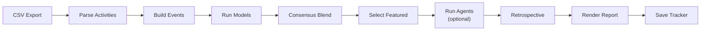

# Feedcast

A tired dad built a feeding-schedule predictor for his structure-oriented
wife — and an excuse to see how far agentic engineering can go on a real
problem.

Feedcast predicts the next 24 hours of bottle feeds for a newborn, using
an ensemble of scripted forecasting models and LLM agents run against
Nara Baby app exports. Feed timing is the primary target. Each run
evaluates the prior run's predictions against newly observed feeds —
there is no backtesting.

## Latest Forecast


*Latest committed forecast from the consensus blend.
Full report: [report/report.md](report/report.md).*

Reports are committed as markdown directly in the repo — simple, effective,
and always one click away.

## The Forecasting Challenge

The only input is feeding history: timestamps and volumes from a
baby-tracking app. Factors that clearly influence when a baby eats —
sleep state, growth spurts, developmental leaps — aren't captured in
the data. The baby is growing fast, so patterns shift week to week.

Despite this, feeding cadence has exploitable structure. Larger feeds
tend to precede longer gaps. The daily feed count is relatively stable
even as timing drifts. These regularities are what the models try to
extract from limited, non-stationary data.

## Forecast Sources

**Scripted models** run deterministically from the event history:

| Model | Approach |
| ----- | -------- |
| Recent Cadence | Recency-weighted interval between full feeds, rolled forward at constant gap |
| Phase Nowcast Hybrid | Phase-locked oscillator backbone with local regression nowcast for the first gap |
| Gap-Conditional | Weighted linear regression on event state, rolled forward autoregressively |
| Consensus Blend | Median-timestamp ensemble across the three scripted models |

**LLM agents** get the export CSV, a shared prompt, and a persistent workspace:

| Agent | Model |
| ----- | ----- |
| Claude Forecast | claude-opus-4-6 (effort: max) |
| Codex Forecast | gpt-5.4 (reasoning: xhigh) |

Each agent writes `forecast.json` and `methodology.md` to its workspace.
Stale outputs are deleted before each invocation so a failed run cannot
reuse prior results. Agents are excluded from the consensus blend and are
never auto-featured.

## Pipeline



| Step | Description |
| ---- | ----------- |
| Parse Activities | Filter feeding events from the raw CSV export |
| Build Events | Create bottle-centered events, merging nearby breastfeed volume |
| Run Models | Execute three scripted models independently |
| Consensus Blend | Median-timestamp ensemble across scripted models |
| Select Featured | Choose the consensus blend, or fall back through a static tiebreaker |
| Run Agents | Claude and Codex produce independent forecasts (optional) |
| Retrospective | Score the prior run's predictions against newly observed actuals |
| Render Report | Generate the markdown report, charts, and diagnostics |
| Save Tracker | Append predictions and retrospective to `tracker.json` |

## Evaluation

There is no historical backtesting. The only accuracy signal is **prospective
performance**: each run compares the prior run's predictions to the actual
feeds observed in the new export. Over time, these results accumulate in
`tracker.json` and are aggregated into a historical accuracy table in the
report.

The featured forecast defaults to the consensus blend. If it's unavailable,
the pipeline falls back through a static scripted tiebreaker list.

## Quick Start

```bash
python3 -m venv .venv
.venv/bin/pip install -r requirements.txt
```

1. Drop the latest Nara export into `exports/`.
2. Run `.venv/bin/python scripts/run_forecast.py`.
3. Read the report at `report/report.md`.

```bash
# Full pipeline (scripted models + LLM agents):
.venv/bin/python scripts/run_forecast.py

# Specific export:
.venv/bin/python scripts/run_forecast.py --export-path exports/export_narababy_silas_YYYYMMDD.csv

# Scripted models only (skip LLM agents):
.venv/bin/python scripts/run_forecast.py --skip-agents
```

LLM agent forecasts require local `claude` and `codex` CLIs with working auth.
Use `--skip-agents` if they're unavailable.

Each run updates these artifacts:

- `report/report.md` — the human-readable forecast report
- `report/schedule.png` — the featured schedule chart
- `report/spaghetti.png` — the all-model trajectory chart
- `report/diagnostics.yaml` — structured model diagnostics
- `tracker.json` — stored predictions and retrospective history

## Repo Layout

```text
scripts/
  run_forecast.py              CLI entrypoint
feedcast/
  pipeline.py                  End-to-end orchestration
  data.py                      CSV parsing, domain types, fingerprinting
  models/                      Scripted forecasters and consensus blend
    notes.md                   Domain observations and model critique
    shared.py                  Shared utilities and tuning constants
    recent_cadence.py          Interval baseline
    phase_nowcast.py           Recursive state-space + nowcast
    gap_conditional.py         Event-level autoregressive regression
  agents.py                    Agent runner (points to repo-level agents/)
  tracker.py                   Run persistence and retrospectives
  report.py                    Markdown rendering and atomic report swap
  plots.py                     Schedule and trajectory chart generation
  templates/
    report.md.j2               Jinja2 report template
agents/
  run.sh                       Shell dispatcher for Claude/Codex CLIs
  prompt/prompt.md             Shared agent prompt
  claude/                      Claude persistent workspace
  codex/                       Codex persistent workspace
exports/                       Raw Nara CSV drops (untracked)
report/                        Latest report (tracked, committed)
tracker.json                   Run history with predictions and retrospectives
```

## Working with Models

**Add a model:** Create a new file in `feedcast/models/`, implement a forecast
function with the signature `(history, cutoff, horizon_hours) -> Forecast`,
define `MODEL_NAME`, `MODEL_SLUG`, and `MODEL_METHODOLOGY`, then add a
`ModelSpec` entry to the `MODELS` list in `feedcast/models/__init__.py`.

**Remove a model:** Delete its `ModelSpec` from the `MODELS` list. Optionally
delete the file.

**Tune parameters:** All model constants live in `feedcast/models/shared.py`
with descriptive names. Adjust them and rerun.

**Change the featured default:** Set `FEATURED_DEFAULT` in
`feedcast/models/__init__.py` to any available model slug.

**Domain notes:** Observations about feeding patterns and model critique are
captured in `feedcast/models/notes.md`. Models are not required to follow
these notes — they are a reference point, not a specification.

## Working with Agents

**Edit the shared prompt:** Modify `agents/prompt/prompt.md`. Both agents
receive the same prompt, prepended with the resolved export path and workspace
path.

**Iterate on one agent's strategy:** Each agent's workspace persists across
runs. Agents can keep durable strategy notes in separate workspace files.

**Add or swap an agent:** Edit the `AGENTS` list in `feedcast/agents.py` and
add a corresponding case to `agents/run.sh`.

## Design Decisions

| Decision | Choice | Rationale |
| -------- | ------ | --------- |
| Scripted models | 3 distinct approaches | Interval baseline, recursive state-space, event regression for ensemble diversity |
| Ensemble | Consensus uses scripted models only | Agents excluded until retrospectives demonstrate consistent value |
| Featured forecast | Consensus > static tiebreaker | Simple default; manually overridable via `FEATURED_DEFAULT` |
| Agent failure | Fail fast | Use `--skip-agents` to work around; no silent fallback |
| Model registration | Explicit `MODELS` list | No auto-discovery; you see what runs by reading one list |
| Report tracking | `report/` and `tracker.json` committed | One workspace; latest report always accessible; diffs are readable |
| Exports | Untracked raw drops | Reproducibility via `tracker.json` dataset fingerprints |
| Report write | Atomic swap with rollback | If rendering fails, the prior report is preserved |

## Principles

- Feed timing is the success metric. Volume is secondary.
- Prefer simple approaches until complexity clearly earns its keep.
- Let new exports drive iteration. The goal is the next 24 hours.
- Simplicity wins unless the forecast improves.

## Built With

This project was built with Claude and Codex, coordinated via
[claodex](https://github.com/joshuavictorchen/claodex). The LLM agents
that produce forecasts run as CLI tools (`claude`, `codex`), not through
APIs — the same way the project itself was developed.
