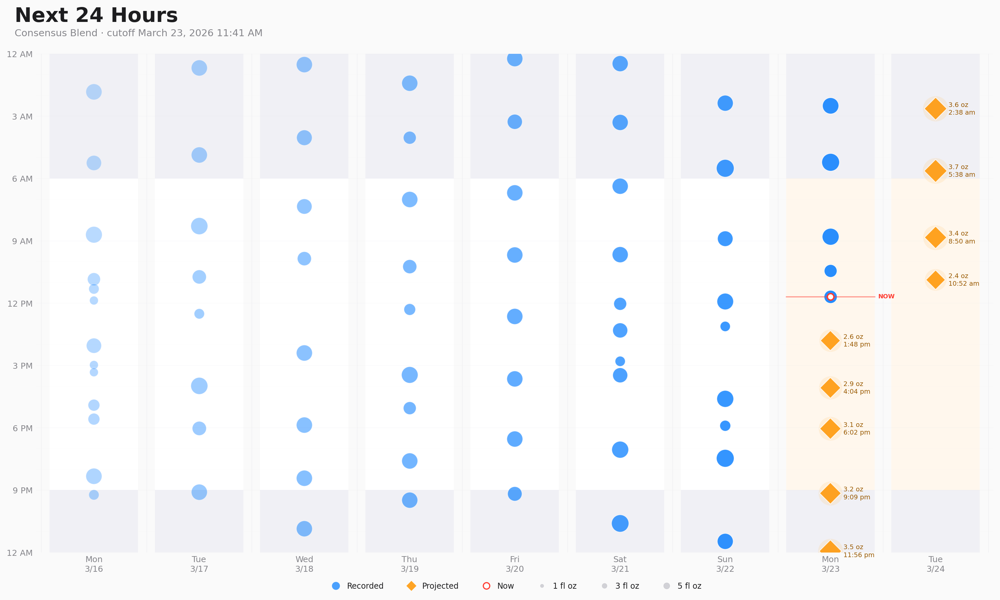
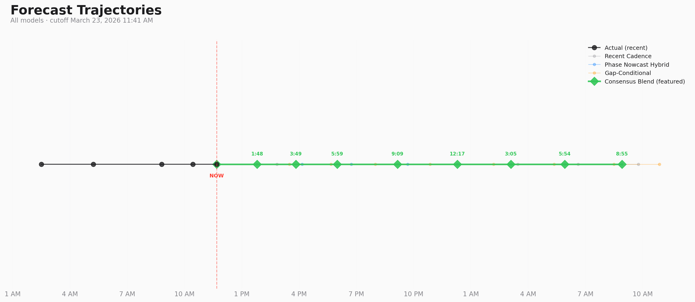

# Silas Feeding Forecast

**Monday, March 23, 2026** · 24 days old · Cutoff: 11:41 AM

## Next Feeds

**Consensus Blend** predicts **8 feeds** over the next 24 hours, totaling **25.6 oz**.

| Feed | Time | Gap | Volume |
|------|------|-----|--------|
| 1 | **1:48 PM** | 2.1h | 2.3 oz |
| 2 | **3:49 PM** | 2.0h | 2.7 oz |
| 3 | **5:59 PM** | 2.2h | 3.0 oz |
| 4 | **9:09 PM** | 3.2h | 2.9 oz |
| 5 | **12:17 AM** | 3.1h | 3.5 oz |
| 6 | **3:05 AM** | 2.8h | 3.5 oz |
| 7 | **5:54 AM** | 2.8h | 4.0 oz |
| 8 | **8:55 AM** | 3.0h | 3.6 oz |

## Model Trajectories

## Model Comparison

| Model | Status | First Feed | Feed Times |
|-------|--------|------------|------------|
| Recent Cadence | Available | 2:50 PM | 2:50 PM, 5:59 PM, 9:09 PM, 12:18 AM, 3:27 AM, 6:37 AM, 9:46 AM |
| Phase Nowcast Hybrid | Available | 1:46 PM | 1:46 PM, 4:09 PM, 6:44 PM, 9:41 PM, 12:17 AM, 3:05 AM, 5:54 AM, 8:55 AM |
| Gap-Conditional | Available | 1:48 PM | 1:48 PM, 3:30 PM, 5:40 PM, 8:00 PM, 10:52 PM, 2:11 AM, 5:21 AM, 8:29 AM, 10:52 AM |
| Consensus Blend | Featured | 1:48 PM | 1:48 PM, 3:49 PM, 5:59 PM, 9:09 PM, 12:17 AM, 3:05 AM, 5:54 AM, 8:55 AM |

## Prior Run Retrospective
No new actuals since the prior run (same dataset: `sha256:7b6cdd2f...`).

## Historical Retrospective Accuracy
No completed retrospective history yet.

## Methodologies
### Recent Cadence

Bottle-only interval baseline. It keeps only full feeds (>=1.5 oz) from the last 3 days, computes the gap between consecutive full feeds, and applies exponential recency weights to those gaps using the midpoint timestamp of each gap (half-life = 36h). Separately, it estimates a day-level prior from recent feeds-per-day counts using exponential day weights (half-life = 2 days), clamps that rate to 6.5-10.5 feeds/day, and converts it into a target interval 24 / feeds_per_day. The final interval estimate is clip(0.7 * weighted_recent_gap + 0.3 * target_interval, 1.5h, 6.0h).

Projection is a constant-gap roll-forward from the latest observed bottle time. For projected volumes, it builds a 12-bin two-hour time-of-day profile over the last 7 days with exponential recency weighting. Each bin stores a weighted mean volume; empty bins fall back to the global weighted average. Each forecast point therefore combines a simple constant timing rule with a time-of-day volume lookup rather than trying to model volume causally.
### Phase Nowcast Hybrid

Breastfeed-aware recursive state-space model built on a Phase-Locked Oscillator (PLO) backbone. Inputs are bottle-centered events whose effective volume includes breastfeeding logged within the merge window. The model first estimates a nominal target interval from the most recent up to 24 events: it computes recency-weighted observed gaps (half-life = 36h), blends that 70/30 with a feeds-per-day prior derived from day-level weights (clamped to 6.0-10.5 feeds/day), then clips the result to 1.5-6.0h.

The PLO initializes its period at that target interval and then walks forward through roughly the last 28 events. For each observed transition, it predicts the next gap as `period + 0.5 * (previous_volume - running_average_volume)`, measures the error versus the actual gap, and updates the period with a filter gain beta = 0.05. The running average volume updates as 70% old + 30% new. During forecast rollout, the period mean-reverts 20% toward the target interval on each step. Projected volume is clip(0.65 * time_of_day_bin_mean + 0.35 * running_average_volume, 0.5, 8.0), where the time-of-day profile is a 12-bin two-hour weighted volume profile over the last 7 days with global-mean fallback for empty bins.

The "nowcast" layer fits a separate weighted linear regression on the last 5 days of events to predict only the immediate next gap. Its features are [current volume, previous observed gap, rolling 3-gap mean, sin(hour), cos(hour)] with exponential sample weights (half-life = 36h). If this local first-gap estimate is within 30 minutes of the phase estimate and the latest event is a full feed (>=1.5 oz), the first gap is blended as 40% phase + 60% state regression. All later forecast points are shifted by the same delta, preserving the PLO's internal spacing. If those conditions fail, the raw phase forecast is used unchanged.
### Gap-Conditional

Breastfeed-aware event-level regression. It uses bottle-centered events whose effective volume includes breastfeeding merged into the next bottle feed. Training data is the last 5 days of events (including snacks). For each eligible event, the target is the observed gap until the following feed. The feature vector is [current volume, previous observed gap, rolling mean of the last 3 gaps, sin(2*pi*hour/24), cos(2*pi*hour/24)]. Samples receive exponential recency weights with half-life = 36h, and coefficients are fitted with weighted normal equations `(X^T W X)^-1 X^T W y`. The predicted gap is clipped to 1.5-6.0h.

For projection, the model does not emit one gap and stop. It rolls forward autoregressively: each predicted feed is appended as a synthetic event, using volume from a 12-bin two-hour time-of-day profile built over the same 5-day window with exponential recency weighting and global-mean fallback for empty bins. The next gap is then predicted from this updated synthetic state using the same fitted coefficients. That preserves volume-to-gap feedback across the entire 24-hour forecast horizon instead of treating each step independently.
### Consensus Blend (featured)

Median-timestamp ensemble across the three scripted base models (Recent Cadence, Phase Nowcast Hybrid, Gap-Conditional). It does not align forecasts by feed index, because different models may emit different numbers of future feeds. Instead, on each step it takes the next unconsumed point from every available model, computes the median timestamp as an anchor, and forms a cluster from points within +/-90 minutes of that anchor.

Points that fall earlier than the cluster window are discarded as leading outliers. If fewer than two models fall into the current cluster, the earliest candidate is discarded and the procedure retries. Once a cluster contains at least two models, the consensus point uses the median timestamp and mean volume across that cluster, with its gap measured from the previous consensus point. The process repeats until fewer than two models have points left. This lets the blend stay robust when one model predicts an extra snack feed or drifts earlier/later than the others.

## Notes

- **Limited data:** 8 days of usable history since March 15, 2026. A few minutes of difference can look meaningful before enough real retrospectives accumulate.
- **Non-stationarity:** Silas is growing fast. Older runs are still useful, but they are not ground truth for the next developmental phase.
- **Breastfeeding volumes are estimated:** The 0.5 oz per 30 min breastfeeding, merged within 45 min heuristic is not measured intake, so any model that uses it inherits that uncertainty.
- **Diagnostics artifact:** Detailed model diagnostics are saved separately in `diagnostics.yaml` so the main report stays readable.

---

*Export: `export_narababy_silas_20260323.csv` · Dataset: `sha256:7b6cdd2f...` · Commit: `423677b (dirty)` · Generated: 2026-03-23 15:29:32*
